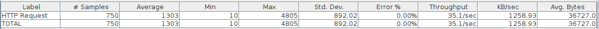
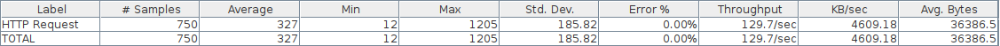
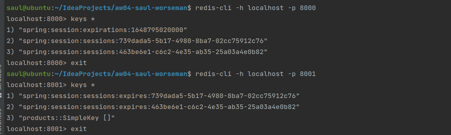

# WebPOS

## aw04 实验报告

### Task 1

+ Build a docker image for this application and performance a load testing against it.

任务流程

+ 根据Jakob jenkov的Tutorial 编写Dockerfile，构建容器。
    + jdk11的镜像使用ssr才能下载，初步推断vmess代理的udp可能被防火墙拦截，或者代理的层级不够
    + 出现jvm内存不够的情况，根据stackoverflow编写docker-compose.yml
+ 使用Jmeter进行压力测试。

限制cpu核心数为0.5的情况下，模拟50个用户在15秒内每秒发50个请求，测试结果如下。




### Task 2

+ Make this system horizontally scalable by using haproxy and performance a load testing against it.

+ 水平扩展，利用HAproxy将8080端口分发给8081-8084进行处理。

同样在限制cpu核心为0.5的情况下，最大相应时间和平均响应时间几乎为单server的四分之一、几乎没有产生边际效应。




### Task 3

+ Take care of the **cache missing** problem (you may cache the products from jd.com) and **session sharing** problem (you may use a standalone mysql db or a redis cluster). Performance load testings.

+ 根据老师的脚本构建redis cluster

    + 脚本需要修改，redis-cli create ...，这条命令不能在后台运行，否则，会因为要我确认config让我输入yes，但是yes会给bash，执行yes命令。
    + redis.conf也进行了修改，因为docker内部连不上127.0.0.1:xxxx,根据群里学长探索，修改为本机ip后，需要disable掉protection mode。

+ 运行Haproxy 和4个webpos后分别使用chrome和firefox打开webpos。

    + 第二个打开的浏览器肉眼可见的更快了。

    + 可以看到redis集群中有缓存的数据和session

      


The demo shows a web POS system , which replaces the in-memory product db in aw03 with a one backed by 京东.


To run

```shell
mvn clean spring-boot:run
```

Currently, it creates a new session for each user and the session data is stored in an in-memory h2 db. 
And it also fetches a product list from jd.com every time a session begins.

1. Build a docker image for this application and performance a load testing against it.
2. Make this system horizontally scalable by using haproxy and performance a load testing against it.
3. Take care of the **cache missing** problem (you may cache the products from jd.com) and **session sharing** problem (you may use a standalone mysql db or a redis cluster). Performance load testings.

Please **write a report** on the performance differences you notices among the above tasks.

